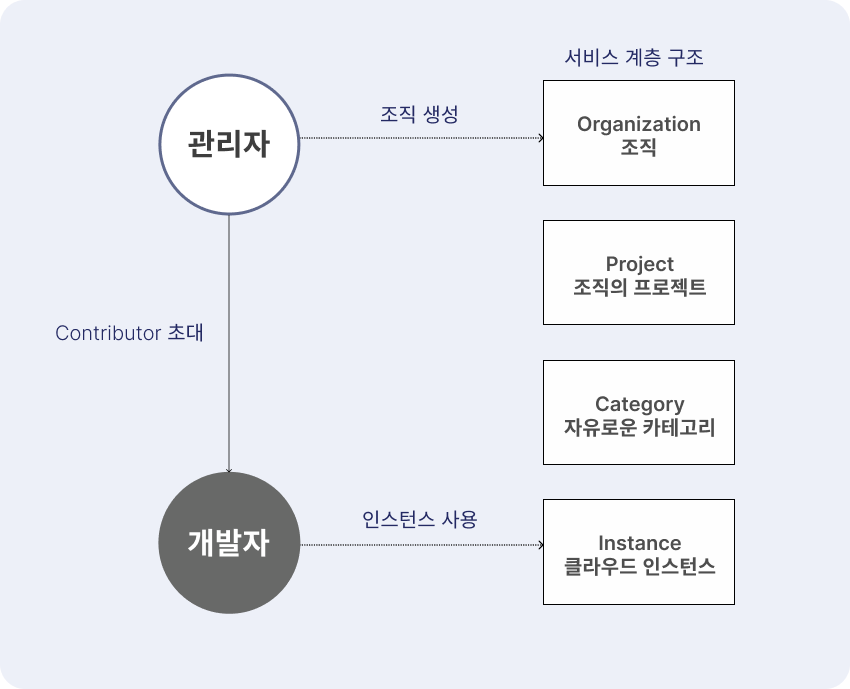

# Shade

> 개발 중인 프로젝트입니다.
[English README](./README-EN.md)
<p align="center">
 
 
</p>

## 프로젝트 동기
_이 프로젝트는 제가 운영체제 및 클라우드 연구실의 학부연구생으로 있을 때의 경험이 바탕이 되었습니다._

연구실에서는 연구 목적으로 우분투 서버를 학생들에게 할당해주었는데,

**구글 공유문서**로 각자에게 할당된 IP를 공유 받고, 접속하여 작업하였습니다.

하지만 위 과정에서 문서를 통해 ```Private IP``` 및 ```1:1 NAT Public IP```를 공유하는 방식은
보안적으로 문제가 있을 수 있다고 생각하였습니다.

따라서 **애초에 연구실 관리자가 연구실 학생에게 IP를 알려주지 않고도 작업할 수 있도록 할 수 없을까?**

위 생각을 바탕으로 **"서버 접속정보를 공유 및 접속하는 방식을 소프트웨어로 자동화해보자!"** 라는 마음을 가지게 되었고,

토이 프로젝트인 **Shade**를 시작하였습니다.

## 프로젝트 소개

### 서비스 흐름도
<p align="center">

</p>

1. 조직 내 관리자는 **조직을 생성**합니다.
2. 조직 내 **project-category-instance**의 계층을 제공하여, 조직의 인스턴스를 직관적으로 관리할 수 있습니다.
3. 관리자는 접속 정보를 토대로 **인스턴스를 등록**합니다.
4. 이후 관리자는 조직 내 개발자를 조직에 **Contributor로 초대**합니다.
5. 조직 내 개발자는 **등록되어 있는 인스턴스를 사용**합니다.

## 프로젝트 실행화면

<p align="center">

</p>

 - 로그인 화면입니다.

<p align="center">

</p>

 - 조직을 생성합니다. 깃허브와 같이 누구나 조직을 생성하여 관리자가 될 수 있습니다.

## 프로토타입 설치
[프로토타입 설치 Wiki](https://github.com/hunsy9/Shade/wiki/2.-Prototype)를 참고해주세요.

## 라이센스
[MIT License](http://opensource.org/licenses/MIT)


