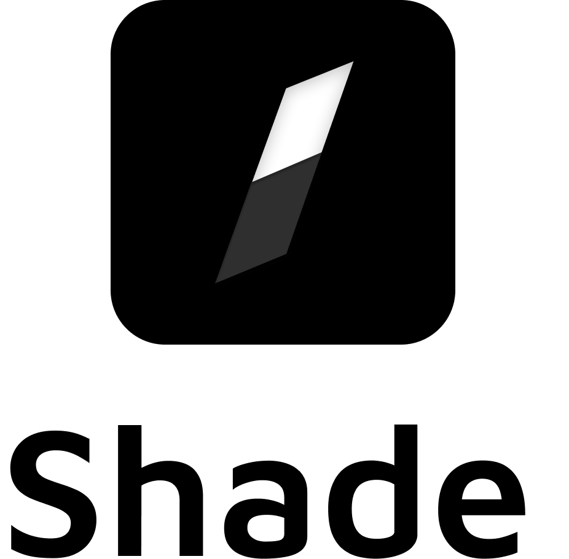

# Shade

### 프로젝트 동기
이 프로젝트는 제가 운영체제 및 클라우드 연구실의 학부연구생으로 있을 때의 경험이 바탕이 되었습니다.

연구실에서는 연구 목적으로 우분투 서버를 학생들에게 할당해주었는데,

**구글 공유문서**로 각자에게 할당된 IP를 공유 받고, 접속하여 작업하였습니다.

하지만 위 과정에서 문서를 통해 Private IP 및 1 : 1 NAT Public IP를 공유하는 방식은
보안적으로 문제가 있을 수 있다고 생각하였습니다.

따라서

**애초에 연구실 관리자가 연구실 학생에게 IP를 알려주지 않고도 작업할 수 있도록 할 수 없을까?**

위 생각을 바탕으로 토이 프로젝트인 **Shade**를 시작하였습니다.