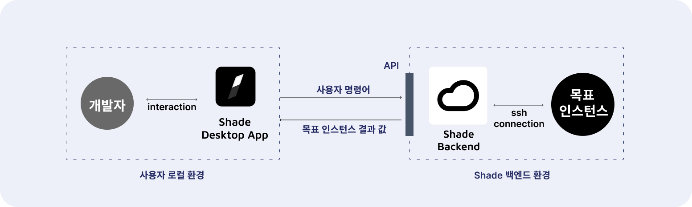
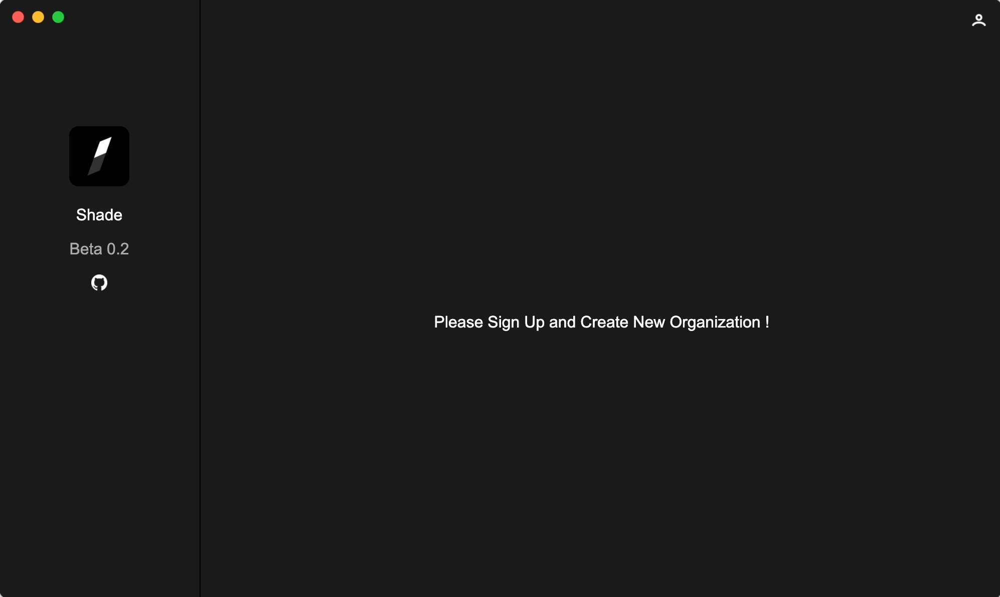

# Shade

> 개발 중인 프로젝트입니다.
[English README](./README-EN.md)
<p align="center">
 
 
</p>

## 프로젝트 동기
_이 프로젝트는 제가 운영체제 및 클라우드 연구실의 학부연구생으로 있을 때의 경험이 바탕이 되었습니다._

연구실에서는 연구 목적으로 우분투 서버를 학생들에게 할당해주었는데,

**구글 공유문서**로 각자에게 할당된 IP를 공유 받고, 접속하여 작업하였습니다.

하지만 위 과정에서 문서를 통해 ```Private IP``` 및 ```1:1 NAT Public IP```를 공유하는 방식은
보안적으로 문제가 있을 수 있다고 생각하였습니다.

따라서 **애초에 연구실 관리자가 연구실 학생에게 IP를 알려주지 않고도 작업할 수 있도록 할 수 없을까?**

위 생각을 바탕으로 **"서버 접속정보를 공유 및 접속하는 방식을 소프트웨어로 자동화해보자!"** 라는 마음을 가지게 되었고,

토이 프로젝트인 **Shade**를 시작하였습니다.

## 프로젝트 소개

### 프로젝트 목표 및 아이디어

개발 조직에서 관리자를 제외한 인원에게 **접속정보를 은닉**하기 위해, 

개발 조직의 특정 서버에서 사용자들이 **원하는 목적지로의 ssh 연결을 대신 맺고**,

사용자가 이 **연결에 명령어를 주입할 수 있는 API를 제공**하는 것이 목표입니다.

<p align="center">

</p>

위 그림처럼 핵심 아이디어는 **접속을 대리하고 이를 사용자와 공유**하는 것입니다.

이때 **shade backend**는 마치 **reverse proxy**처럼 작용할 수 있습니다.

사용자는 데스크톱 어플리케이션의 인터페이스를 통해 접속을 대리하는 외부 환경과 통신할 수 있으며,

세부 프로젝트 구조는 [이곳](https://github.com/hunsy9/Shade/wiki/4.-Architecture)에서 확인하실 수 있습니다.

### 서비스 흐름도

다음은 서비스의 구조 및 흐름입니다.

<p align="center">

</p>

1. 조직 내 관리자는 **조직을 생성**합니다.
2. 조직 내 **project-category-instance**의 계층을 제공하여, 조직의 인스턴스를 직관적으로 관리할 수 있습니다.
3. 관리자는 접속 정보를 토대로 **인스턴스를 등록**합니다.
4. 이후 관리자는 조직 내 개발자를 조직에 **Contributor로 초대**합니다.
5. 조직 내 개발자는 **등록되어 있는 인스턴스를 사용**합니다.

## 프로젝트 실행화면

### 로그인 화면
- 로그인/회원가입이 가능합니다.
<p align="center">

</p>

### 조직 생성
- 깃허브와 같이 누구나 조직을 생성하여 관리자가 될 수 있습니다.
<p align="center">

</p>

### 조직 > 프로젝트 > 카테고리
- 관리자는 서버 접속 정보를 **프로젝트 > 카테고리** 내에 등록할 수 있습니다.
<p align="center">

</p>

### Contributor(조직 내 개발자)를 초대
- 관리자는 **Contributor(조직 내 개발자)를 초대**하여 관리할 수 있습니다.
<p align="center">

</p>

### 조직의 서버 접속 정보를 등록
- 관리자는 **조직의 서버 접속 정보를 등록**합니다.
<p align="center">

</p>

### 접속 정보 없는 서버 접속
- Contributor(조직 내 개발자)는 관리자가 등록해놓은 서버를 접속 정보 없이 사용할 수 있습니다.

<p align="center">

</p>

더 자세한 기능 명세는 [UseCase Wiki](https://github.com/hunsy9/Shade/wiki/5.-Use-Case)를 참고해주세요.

## 프로토타입 설치
[프로토타입 설치 Wiki](https://github.com/hunsy9/Shade/wiki/2.-Prototype)를 참고해주세요.

## 라이센스
[MIT License](http://opensource.org/licenses/MIT)


